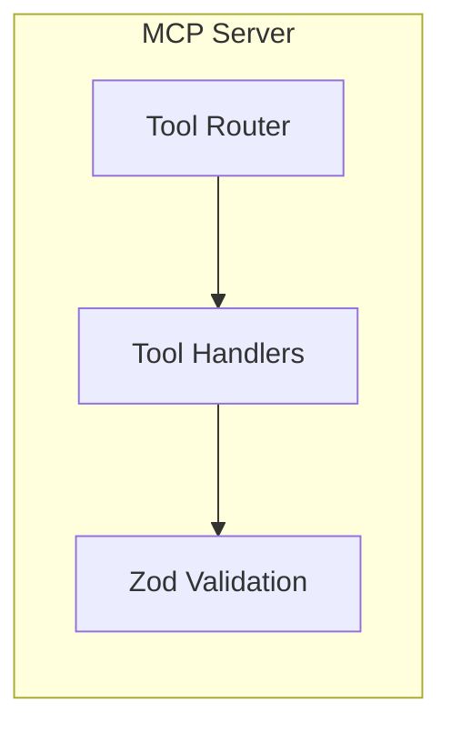
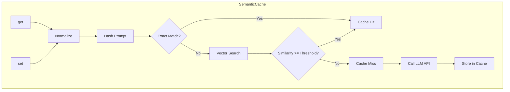
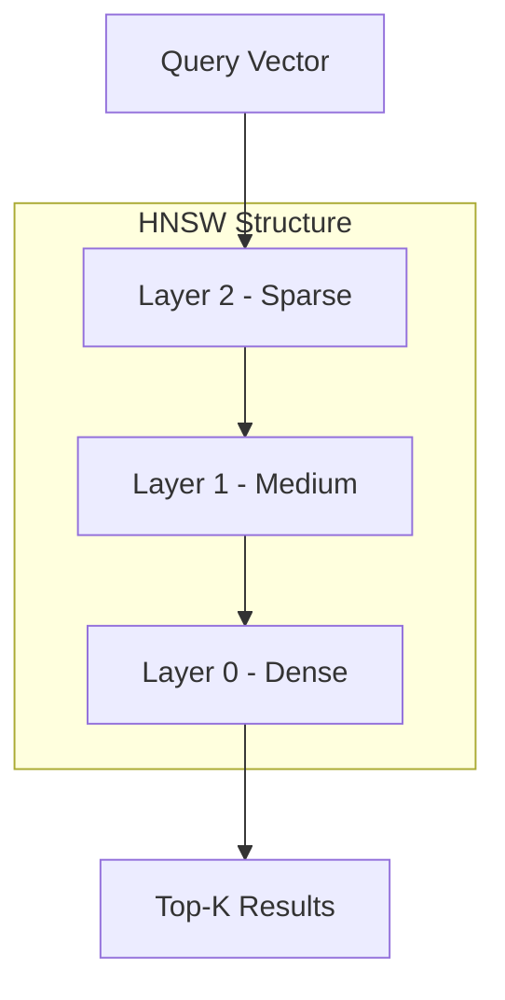
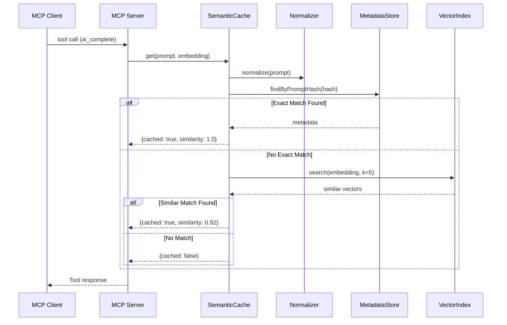
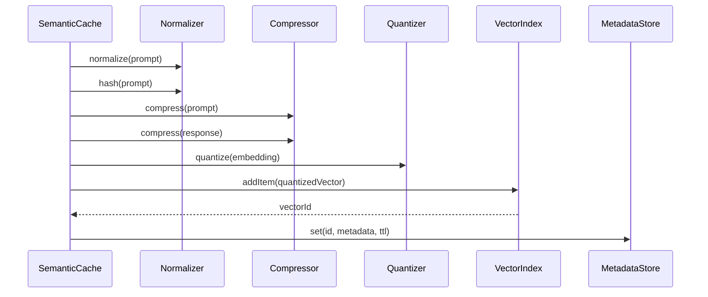
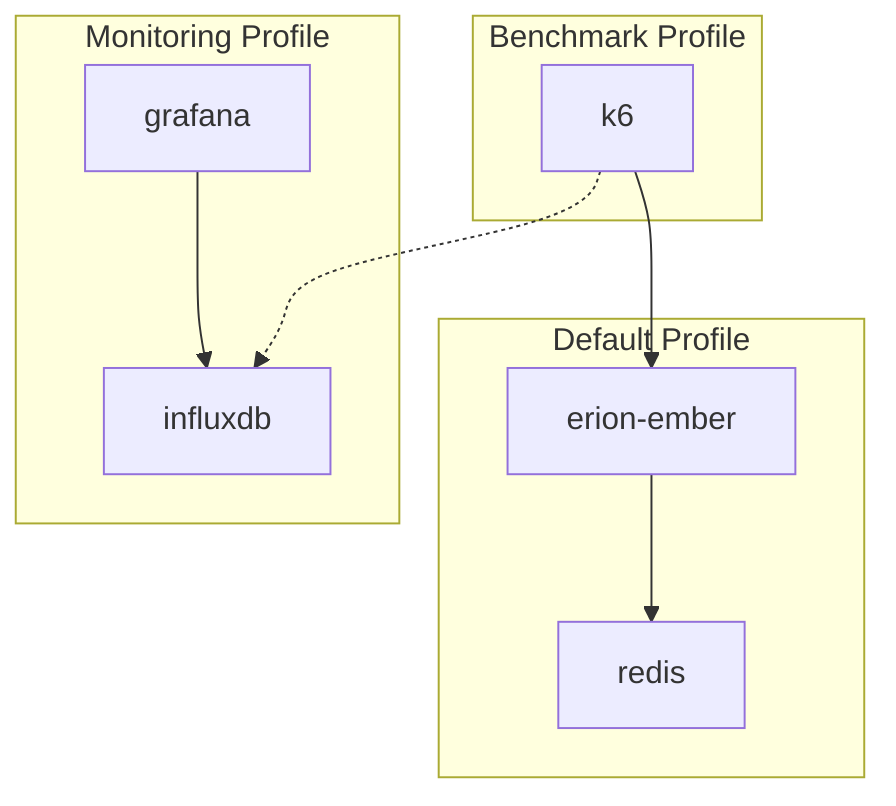
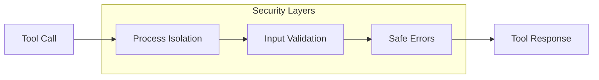

# Erion Ember - Architecture Documentation

## Overview

Erion Ember is a high-performance semantic caching layer for LLM applications. It reduces costs and latency by intelligently caching responses and serving them for semantically similar queries.

## System Architecture

```mermaid
graph TB
    subgraph "Client Layer"
        C[MCP Client]
    end
    
    subgraph "MCP Server"
        MCP[Stdio MCP Server]
        TOOLS[Tool Handlers]
        V[Zod Validator]
    end
    
    subgraph "Core Layer"
        SC[SemanticCache]
        N[Normalizer]
        Q[Quantizer]
        COMP[Compressor]
        VI[VectorIndex (Annoy/HNSW)]
        MS[MetadataStore]
        ES[EmbeddingService]
    end
    
    subgraph "External Services"
        EMB[Embedding API (OpenAI)]
    end
    
    C --> MCP
    MCP --> TOOLS --> V
    V --> SC
    TOOLS --> ES
    ES -.-> EMB
    SC --> N
    SC --> Q
    SC --> COMP
    SC --> VI
    SC --> MS
```

## Component Architecture

### 1. MCP Server Layer



#### Components

| Component | File | Description |
|-----------|------|-------------|
| **MCP Server** | `src/mcp-server.js` | MCP server entry point and tool registration |
| **Tool Handlers** | `src/tools/*.js` | `ai_complete`, `cache_check`, `cache_store`, `cache_stats`, `generate_embedding` |
| **MCP SDK** | `@modelcontextprotocol/sdk` | Protocol handling and transport |
| **Zod Validation** | `zod` | Tool input validation |

### 2. Core Layer - SemanticCache



#### Core Components

| Component | File | Purpose |
|-----------|------|---------|
| **SemanticCache** | `src/lib/semantic-cache.js` | Main cache orchestrator |
| **VectorIndex Interface** | `src/lib/vector-index/interface.js` | Shared vector index contract |
| **VectorIndex Factory** | `src/lib/vector-index/index.js` | Backend selection (`annoy` or `hnsw`) |
| **AnnoyVectorIndex** | `src/lib/vector-index/annoy-index.js` | Pure JS approximate nearest neighbor search |
| **HNSWVectorIndex** | `src/lib/vector-index/hnsw-index.js` | C++ HNSW approximate nearest neighbor search |
| **Quantizer** | `src/lib/quantizer.js` | INT8 vector quantization |
| **Compressor** | `src/lib/compressor.js` | LZ4 text compression |
| **Normalizer** | `src/lib/normalizer.js` | Text normalization and hashing |
| **MetadataStore** | `src/lib/metadata-store.js` | TTL-based metadata storage |

### 3. Vector Index Backends

Erion Ember supports two vector index backends:

- **Annoy.js**: Pure JavaScript, no native dependencies
- **HNSW**: C++ HNSW implementation via `hnswlib-node`

HNSW (Hierarchical Navigable Small World) provides O(log n) approximate nearest neighbor search.



**Key Parameters:**
- **M** (max connections): 16
- **efConstruction** (build quality): 200
- **efSearch** (search quality): 50
- **Metric**: Cosine similarity

### 4. Data Flow

#### Cache Read Flow



#### Cache Write Flow



## Memory Architecture

```mermaid
graph TB
    subgraph "Memory Layout"
        subgraph "Vector Storage"
            VS[Vector Index (Annoy/HNSW)]
            VD[INT8 Vectors]
        end
        
        subgraph "Metadata Storage"
            PM[Prompt Hash Map]
            CM[Compressed Data]
            TM[TTL Timers]
        end
    end
    
    VS --> VD
    PM --> CM
    CM --> TM
```

### Memory Optimization

| Technique | Savings | Description |
|-----------|---------|-------------|
| **INT8 Quantization** | 75% | Float32 → INT8 vectors |
| **LZ4 Compression** | 60-80% | Text compression |
| **Exact Match Index** | O(1) | Hash-based lookup |

## Deployment Architecture

### Docker Compose Profiles



### Container Configuration

| Service | Image | Port | Health Check |
|---------|-------|------|--------------|
| erion-ember | Custom Bun | - | Process health / exit code |
| redis | redis:7-alpine | 6379 | redis-cli ping |
| k6 | grafana/k6 | - | - |
| influxdb | influxdb:2.7 | 8086 | - |
| grafana | grafana/grafana | 3001 | - |

## API Architecture

### MCP Tools

| Tool | Purpose |
|------|---------|
| `ai_complete` | Cache lookup and response (hit or miss) |
| `cache_check` | Cache lookup without storing |
| `cache_store` | Store prompt/response pair |
| `cache_stats` | Cache metrics and savings |
| `generate_embedding` | Generate embedding vector |

### Request/Response Schema

```typescript
// ai_complete Request
interface AiCompleteRequest {
  prompt: string;                 // Required, min 1 char
  embedding?: number[];           // Optional pre-computed embedding
  similarityThreshold?: number;   // Optional override (0-1)
}

// ai_complete Response (embedded in MCP tool response)
interface AiCompleteResponse {
  cached: boolean;
  response?: string;
  similarity?: number;            // Only if cached
  isExactMatch?: boolean;         // Only if cached
  cachedAt?: string;              // ISO 8601
}
```

## Security Architecture



### Security Features

| Feature | Implementation | Configuration |
|---------|---------------|---------------|
| Process Isolation | OS process + stdio transport | Run MCP server as separate process |
| Input Validation | Zod schemas | All tools |
| Error Sanitization | Tool handlers | Return safe errors |

## Performance Characteristics

### Latency Targets

| Operation | Target | Typical |
|-----------|--------|---------|
| Cache Hit (exact) | < 5ms | 1-2ms |
| Cache Hit (semantic) | < 20ms | 5-15ms |
| Cache Miss | < 2s | 500ms-1.5s |

### Throughput

| Test Type | VUs | RPS Target |
|-----------|-----|------------|
| Smoke | 10 | 100+ |
| Load | 200 | 1000+ |
| Stress | 500 | 2000+ |

## Technology Stack

```mermaid
graph TB
    subgraph "Runtime"
        BUN[Bun v1.0+]
    end
    
    subgraph "Protocol"
        MCP[@modelcontextprotocol/sdk]
    end
    
    subgraph "Core Libraries"
        ANNOY[annoy.js]
        HNSW[hnswlib-node]
        LZ4[lz4js]
        XX[xxhash-addon]
        ZOD[Zod]
    end
    
    subgraph "Infrastructure"
        REDIS[Redis 7]
        DOCKER[Docker]
        K6[K6]
    end
    
    BUN --> MCP
    MCP --> ANNOY
    MCP --> HNSW
    MCP --> LZ4
    MCP --> XX
    MCP --> ZOD
```

## Future Considerations

### Scalability

- **Horizontal Scaling**: Stateless design allows multiple instances
- **Redis Cluster**: For distributed caching
- **Embedding Service**: Dedicated microservice for vector generation

### Observability

- **OpenTelemetry**: Distributed tracing
- **Prometheus Metrics**: Detailed performance metrics
- **Structured Logging**: JSON logs for aggregation
