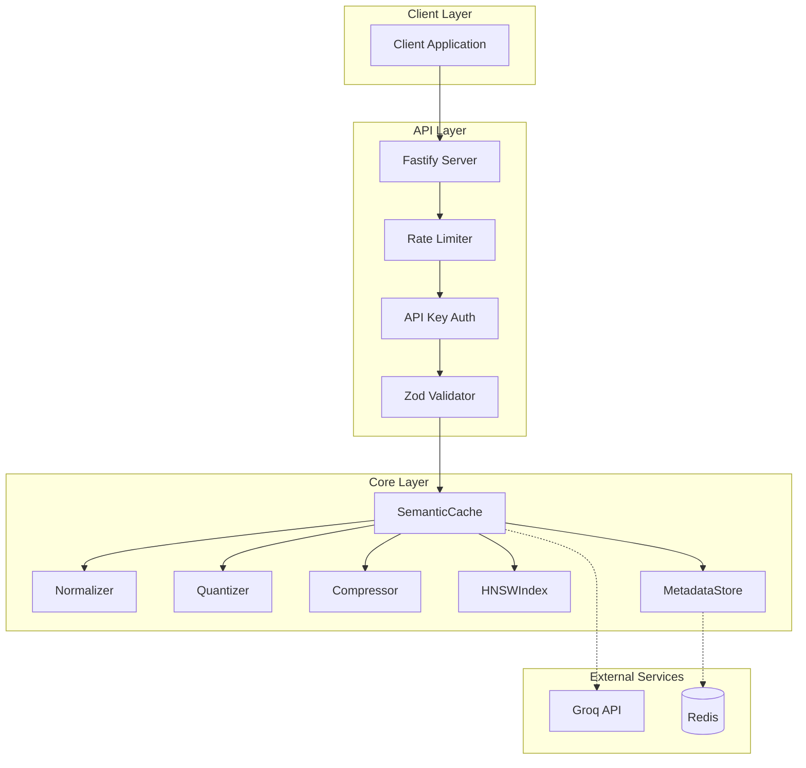
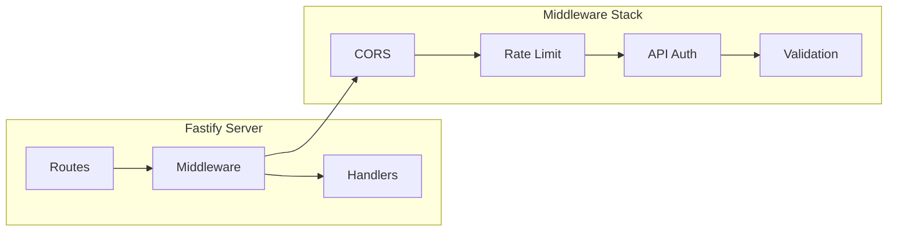
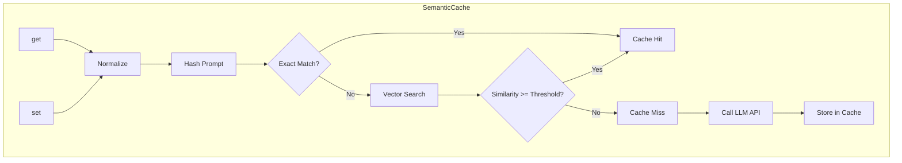
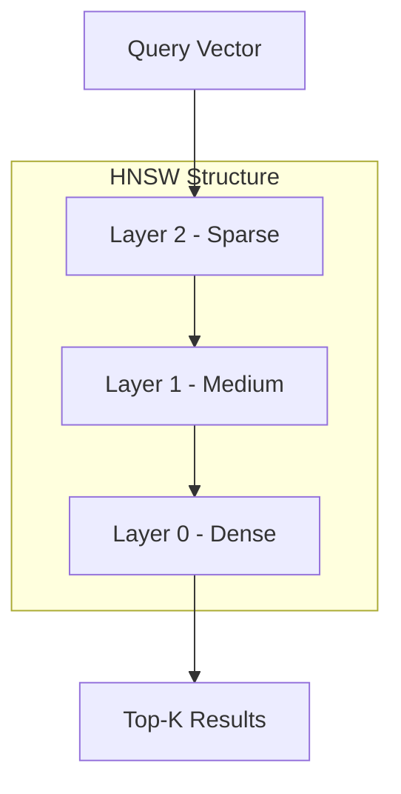
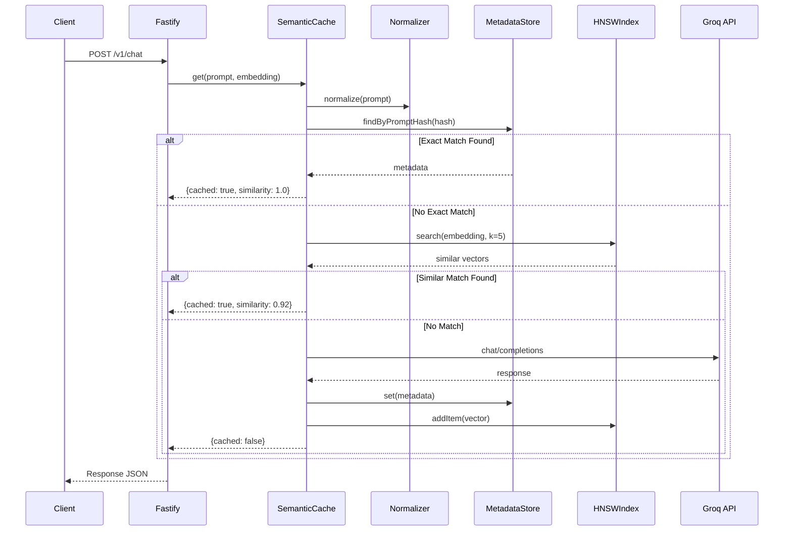
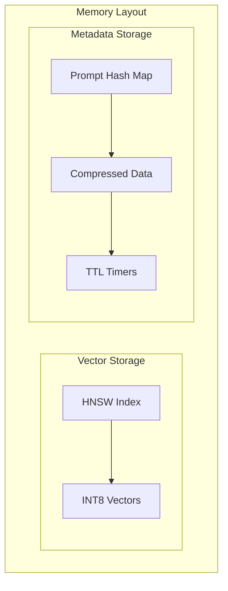
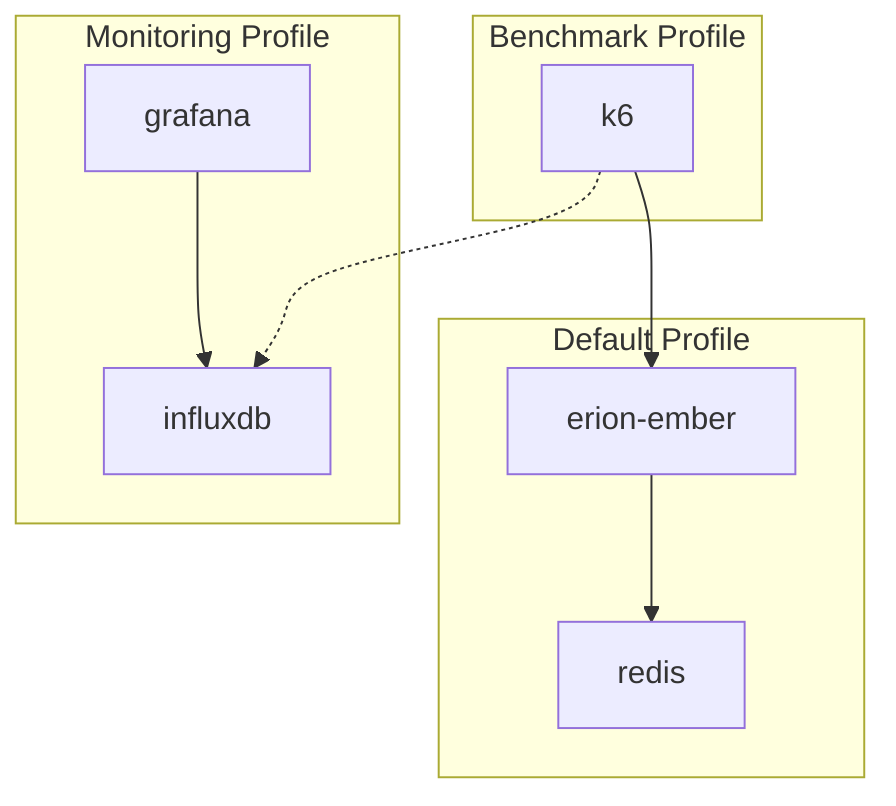
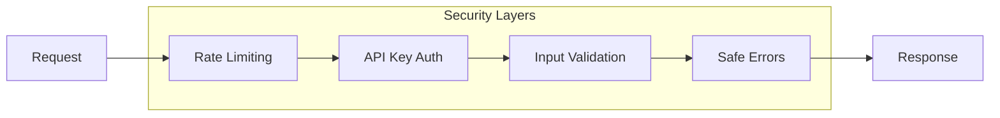
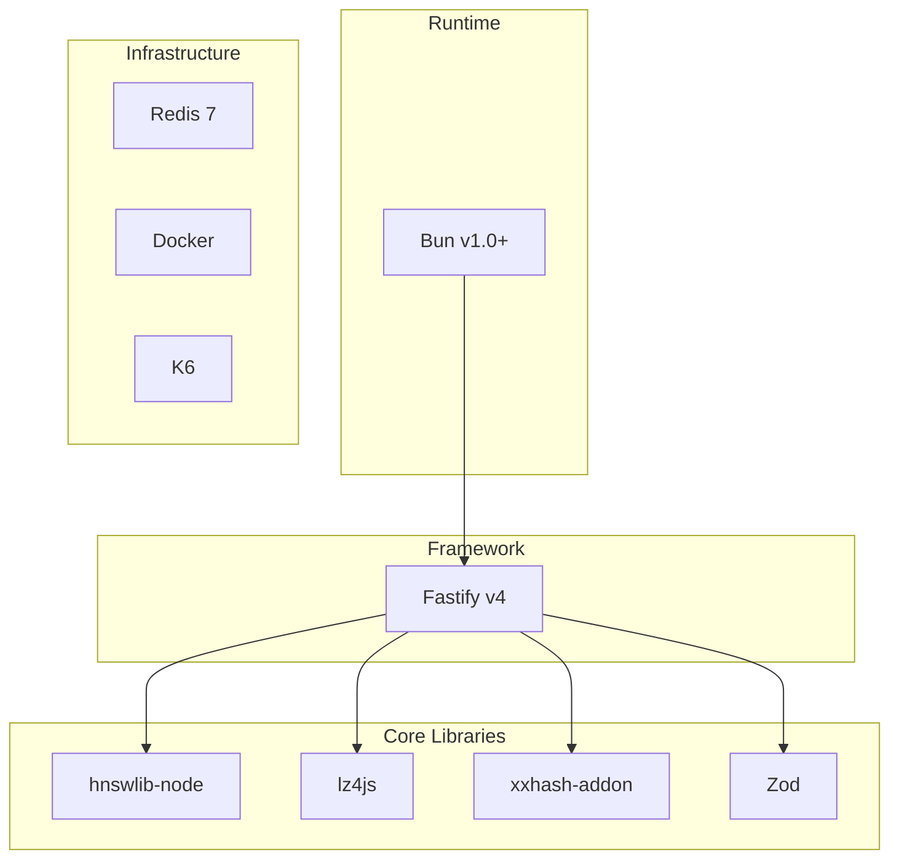

# Erion Ember - Architecture Documentation

## Overview

Erion Ember is a high-performance semantic caching layer for LLM applications. It reduces costs and latency by intelligently caching responses and serving them for semantically similar queries.

## System Architecture



## Component Architecture

### 1. API Layer



#### Components

| Component | File | Description |
|-----------|------|-------------|
| **Server** | `src/server.js` | Fastify server initialization and plugin registration |
| **Chat Route** | `src/routes/chat.js` | Main chat endpoint with caching logic |
| **Rate Limiter** | `@fastify/rate-limit` | 60 requests/minute per IP |
| **CORS** | `@fastify/cors` | Cross-origin resource sharing |

### 2. Core Layer - SemanticCache



#### Core Components

| Component | File | Purpose |
|-----------|------|---------|
| **SemanticCache** | `src/lib/semantic-cache.js` | Main cache orchestrator |
| **HNSWIndex** | `src/lib/hnsw-index.js` | Fast approximate nearest neighbor search |
| **Quantizer** | `src/lib/quantizer.js` | INT8 vector quantization |
| **Compressor** | `src/lib/compressor.js` | LZ4 text compression |
| **Normalizer** | `src/lib/normalizer.js` | Text normalization and hashing |
| **MetadataStore** | `src/lib/metadata-store.js` | TTL-based metadata storage |

### 3. HNSW Index

HNSW (Hierarchical Navigable Small World) provides O(log n) approximate nearest neighbor search.



**Key Parameters:**
- **M** (max connections): 16
- **efConstruction** (build quality): 200
- **efSearch** (search quality): 50
- **Metric**: Cosine similarity

### 4. Data Flow

#### Cache Read Flow



#### Cache Write Flow


## Memory Architecture



### Memory Optimization

| Technique | Savings | Description |
|-----------|---------|-------------|
| **INT8 Quantization** | 75% | Float32 → INT8 vectors |
| **LZ4 Compression** | 60-80% | Text compression |
| **Exact Match Index** | O(1) | Hash-based lookup |

## Deployment Architecture

### Docker Compose Profiles



### Container Configuration

| Service | Image | Port | Health Check |
|---------|-------|------|--------------|
| erion-ember | Custom Bun | 3000 | GET /health |
| redis | redis:7-alpine | 6379 | redis-cli ping |
| k6 | grafana/k6 | - | - |
| influxdb | influxdb:2.7 | 8086 | - |
| grafana | grafana/grafana | 3001 | - |

## API Architecture

### Endpoints

```
┌─────────────────────────────────────────────────────────┐
│ Erion Ember API v1                                       │
├─────────────────────────────────────────────────────────┤
│ POST /v1/chat        │ Chat with semantic caching        │
│ GET  /health         │ Health check                      │
│ GET  /v1/stats       │ Cache statistics                  │
└─────────────────────────────────────────────────────────┘
```

### Request/Response Schema

```typescript
// POST /v1/chat Request
interface ChatRequest {
  prompt: string;      // Required, min 1 char
  model?: string;      // Default: "openai/gpt-oss-120b"
}

// POST /v1/chat Response
interface ChatResponse {
  response: string;
  cached: boolean;
  similarity?: number; // Only if cached
  model: string;
  timestamp: string;   // ISO 8601
  metadata?: object;   // Only if cached
  savings: {
    tokens_saved: number;
    usd_saved: number;
  };
}
```

## Security Architecture



### Security Features

| Feature | Implementation | Configuration |
|---------|---------------|---------------|
| Rate Limiting | @fastify/rate-limit | 60 req/min per IP |
| API Key Auth | Custom middleware | Optional `x-api-key` header |
| Input Validation | Zod schemas | All endpoints |
| Error Sanitization | Custom handler | Production only |

## Performance Characteristics

### Latency Targets

| Operation | Target | Typical |
|-----------|--------|---------|
| Cache Hit (exact) | < 5ms | 1-2ms |
| Cache Hit (semantic) | < 20ms | 5-15ms |
| Cache Miss | < 2s | 500ms-1.5s |

### Throughput

| Test Type | VUs | RPS Target |
|-----------|-----|------------|
| Smoke | 10 | 100+ |
| Load | 200 | 1000+ |
| Stress | 500 | 2000+ |

## Technology Stack



## Future Considerations

### Scalability

- **Horizontal Scaling**: Stateless design allows multiple instances
- **Redis Cluster**: For distributed caching
- **Embedding Service**: Dedicated microservice for vector generation

### Observability

- **OpenTelemetry**: Distributed tracing
- **Prometheus Metrics**: Detailed performance metrics
- **Structured Logging**: JSON logs for aggregation
